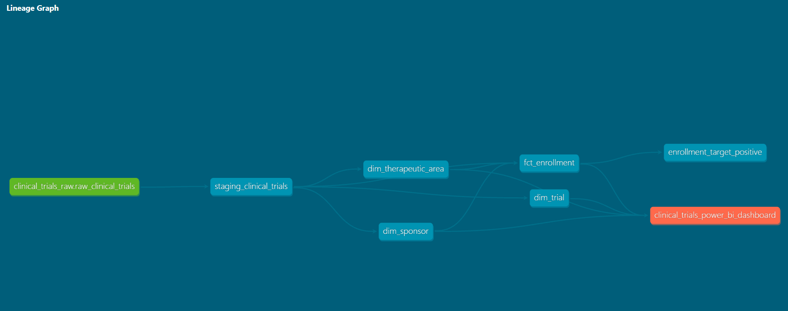

# Clinical Trial Analytics Platform

An end-to-end data pipeline built using **Python**, **dbt Core**, **BigQuery**, and a **medallion architecture** (Bronze → Silver → Gold), consuming real clinical trial data from the ClinicalTrials.gov v2 API.

## Architecture

```
ClinicalTrials.gov API
        │
        ▼
  Python Ingestion (fetch_trials.py)
        │  requests · pandas
        ▼
  Bronze Layer (raw JSON / CSV)
        │
        ▼
  Silver Layer — dbt staging models
  (cleaning, type casting, field standardisation)
        │
        ▼
  Gold Layer — dbt mart models
  (dimensional model: fact + dimension tables)
        │
        ▼
  Parquet export → Power BI
```

## Lineage Graph



## Tech Stack

| Layer | Tool |
|---|---|
| Ingestion | Python (requests, pandas) |
| Transformation | dbt Core |
| Warehouse | Google BigQuery |
| Orchestration | Apache Airflow (local) |
| Serving | Parquet → Power BI |
| Text-to-Speech | ElevenLabs API |

## Project Structure

```
clinical_trial_analytics/
├── ingestion/
│   └── clinical_trials/
│       ├── fetch_trials.py
│       └── export_parquet.py
├── clinical_trials_dbt/
│   ├── macros/
│   │   ├── clean_string.sql
│   │   └── safe_divide.sql
│   ├── models/
│   │   ├── staging/
│   │   │   └── clinical_trials/
│   │   └── marts/
│   │       └── clinical_trials/
│   │           ├── dim_sponsor.sql
│   │           ├── dim_therapeutic_area.sql
│   │           ├── dim_trial.sql
│   │           └── fct_enrollment.sql
│   └── dbt_project.yml
├── tests/
│   └── assert_enrollment_target_positive.sql
└── data/
    └── gold/
```

## dbt Models

### Staging
- `staging_clinical_trials` — standardises raw API data: type casting, field renaming, null handling, phase normalisation

### Marts (Gold Layer)
| Model | Materialisation | Description |
|---|---|---|
| `dim_trial` | table | Core trial attributes (status, phase, start/end dates) |
| `dim_sponsor` | table | Lead sponsor details |
| `dim_therapeutic_area` | table | Condition/disease area classification |
| `fct_enrollment` | incremental | Enrollment targets and actuals per trial |

### Macros
| Macro | Description |
|---|---|
| `clean_string(column)` | Trims whitespace and returns null for empty strings |
| `safe_divide(numerator, denominator)` | Divides safely, returning null on zero denominator |

### Data Quality Tests
- **Schema tests** — `not_null` and `unique` on all primary keys across all models (12 tests)
- **Custom singular test** — `assert_enrollment_target_positive` ensures no negative enrollment targets
- **Source freshness** — warns after 7 days, errors after 14 days of no new data

## Key Design Decisions

- **Incremental model** — `fct_enrollment` uses `merge` strategy on `trial_id`, processing only new records on each run rather than full refresh
- **Reusable macros** — `safe_divide` and `clean_string` encapsulate repeated logic, keeping models clean and consistent
- **Qualify deduplication** — `QUALIFY ROW_NUMBER()` used in `fct_enrollment` to handle trials mapping to multiple therapeutic areas
- **Parquet export** — Gold tables exported to Parquet to enable reliable Power BI connectivity
- **Source freshness monitoring** — dbt freshness checks alert when source data goes stale

## Running the Project

```bash
# 1. Install dependencies
pip install -r requirements.txt

# 2. Fetch data from ClinicalTrials.gov API
python ingestion/clinical_trials/fetch_trials.py

# 3. Run dbt — builds all models and runs all tests
cd clinical_trials_dbt
dbt build

# 4. Export Gold layer to Parquet
python ingestion/clinical_trials/export_parquet.py
```

## Test Results

```
Done. PASS=17 WARN=0 ERROR=0 SKIP=0 TOTAL=17
1 incremental model, 3 table models, 1 view model
12 schema tests + 1 custom singular test
```

## Data Source

[ClinicalTrials.gov v2 API](https://clinicaltrials.gov/data-api/api) — publicly available registry of clinical studies.

## AI Query Agent

A natural language query agent that allows users to ask questions about clinical trial data in plain English.

Built with the Anthropic Claude API — the agent generates BigQuery SQL from a natural language question, runs it against the Gold layer, and returns a plain English summary.

### Voice Responses (ElevenLabs)

The assistant can read its answers aloud using the ElevenLabs Text-to-Speech API. After generating a plain English summary, clicking "Read Answer Aloud" converts the response to speech using the `eleven_multilingual_v2` model and plays it back directly in the app.

### Example Questions

- *"Which therapeutic area has the highest average enrollment target?"*
- *"How many trials are currently recruiting?"*
- *"Which sponsor has the most completed trials?"*

### Running the Agent

**Command line:**
```bash
python ai_agent/query_agent.py
```

**Web interface (Streamlit):**
```bash
streamlit run ai_agent/app.py
```

### Environment Variables

Create a `.env` file with:

```
ANTHROPIC_API_KEY=your_key_here
ELEVENLABS_API_KEY=your_key_here
```

You'll also need a Google Cloud service account JSON key for BigQuery access (see `get_bq_client()` in `app.py` for the expected path).

### Demo


### Example Output

```
Question: Which sponsor has the most completed trials?
Answer: Astrageneca leads all sponsors with the most 
completed clinical trials, having successfully completed 4 trials.
```

